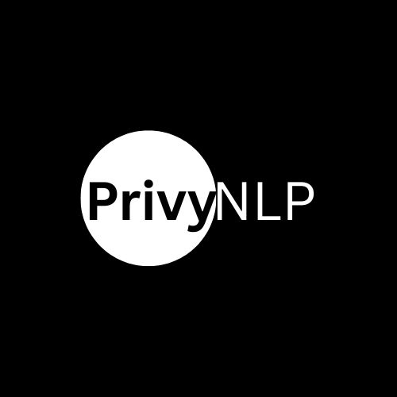

# PrivyNLP


**PrivyNLP** is an open-source, LLM-agnostic Python library for detecting and redacting sensitive information (PII, PHI, payment data) in text.  
Use it as a pre-processing step before sending any text to LLMs or external APIs.

---

## Features

- **Detects PII & PHI:**  
  - Names, dates, locations, organizations
  - Emails, phone, fax, SSN, account, medical record, insurance, certificate/license, driver’s license, passport, bank account, credit card
  - URLs, IP addresses, device ID, vehicle ID, biometric terms, relatives’ names, DOB
- **Redacts/masks sensitive entities before text leaves your system**
- **Easy plug-and-play API**
- **Extensible detection patterns**
- **Pure Python—no OpenAI or Hugging Face dependencies**

---

## Installation

```bash
pip install privynlp
python -m spacy download en_core_web_sm
```
> The second command downloads spaCy’s English entity model.

---

## Quickstart

```python
from privynlp import PrivyNLP

extractor = PrivyNLP()
text = """
Patient John Doe (MRN123456) visited MedHealth on 07/10/2025. Email: john.doe@example.com
Phone: 555-123-4567, SSN: 123-45-6789, Credit card: 4111 1111 1111 1111
Mother's maiden name: Smith, Device serial: device-XJ1234
Passport: K1234567, URL: https://med.org/patient, IP: 192.168.1.1
"""
entities = extractor.extract(text)
print(entities)
# Redact before sending to LLM
redacted = extractor.redact(text)
print(redacted)
```

---

## What Is Detected?

| Type              | Example(s)                        |
|-------------------|-----------------------------------|
| PERSON            | John Doe, Jane Smith              |
| EMAIL             | john.doe@example.com              |
| PHONE/FAX         | 555-123-4567                      |
| SSN               | 123-45-6789                       |
| CREDIT_CARD       | 4111 1111 1111 1111               |
| MEDICAL_RECORD    | MRN123456                         |
| HEALTH_INSURANCE  | HIN654321                         |
| ACCOUNT_NUMBER    | ACCT:123456, Account #987654      |
| DRIVER_LICENSE    | D123456789                        |
| PASSPORT          | K1234567                          |
| URL               | https://myhealth.org/patient      |
| IP_ADDRESS        | 192.168.1.1                       |
| BIOMETRIC         | fingerprintscan, retinalscan      |
| CERTIFICATE/LICENSE| cert-ABC123, licenseXYZ          |
| VEHICLE_ID        | VIN:1HGCM82633A004352             |
| DEVICE_ID         | device-XJ1234, serial-98765       |
| BANK_ACCOUNT      | bank-123456, account-654321       |
| RELATIVE_NAME     | Mother's maiden name: Smith       |
| DOB/DATE          | 07/10/2025, 1965-12-31            |
| ORG, GPE, LOC, FAC| MedHealth, New York, Room 304     |

---

## Extending Detection

Add your own regex patterns or spaCy labels in `extractor.py` for other identifiers.

---

## Testing

```bash
pytest tests/
```

---

## Contributing

See [`CONTRIBUTING.md`](CONTRIBUTING.md) for guidelines.

---

## License

MIT

---

## Roadmap

- Add more PHI/PII patterns
- Masking options (span preservation, custom tokens)
- CLI and web interface